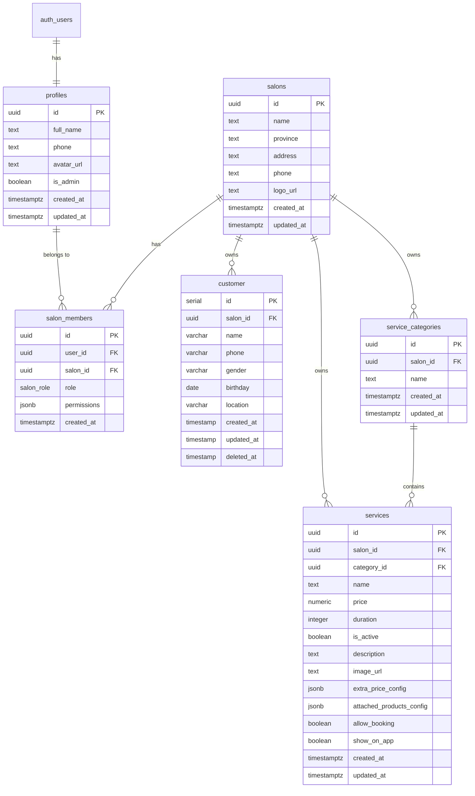

# Salon Pro - Database Schema & Security Documentation

This document provides a comprehensive overview of the database schema, Row Level Security (RLS) policies, and permission system for the Salon Pro multi-tenant application.

---

## Table of Contents

- [Overview](#overview)
- [Entity Relationship Diagram](#entity-relationship-diagram)
- [Tables](#tables)
- [Permission System](#permission-system)
- [RLS Policies](#rls-policies)
- [Helper Functions](#helper-functions)
- [Usage Examples](#usage-examples)

---

## Overview

Salon Pro is a **multi-tenant** salon management system where:

- Each **salon** can have multiple **members** (owner, managers, employees)
- Each member has **granular permissions** controlling what they can do
- A **system admin** (defined by `is_admin = TRUE` in profiles) has full access to everything
- All data is isolated per-salon using Row Level Security (RLS)

---

## Entity Relationship Diagram



---

## Tables

### `profiles`

Extends Supabase `auth.users` with additional user information.

| Column       | Type        | Description                                    |
| ------------ | ----------- | ---------------------------------------------- |
| `id`         | UUID        | Primary key, references `auth.users(id)`       |
| `full_name`  | TEXT        | User's display name                            |
| `phone`      | TEXT        | Phone number                                   |
| `avatar_url` | TEXT        | Profile picture URL                            |
| `is_admin`   | BOOLEAN     | `TRUE` = System administrator with full access |
| `created_at` | TIMESTAMPTZ | Auto-set on creation                           |
| `updated_at` | TIMESTAMPTZ | Auto-updated on changes                        |

---

### `salons`

Represents a salon business.

| Column     | Type | Description    |
| ---------- | ---- | -------------- |
| `id`       | UUID | Primary key    |
| `name`     | TEXT | Salon name     |
| `province` | TEXT | Province/city  |
| `address`  | TEXT | Full address   |
| `phone`    | TEXT | Contact phone  |
| `logo_url` | TEXT | Salon logo URL |

---

### `salon_members`

Junction table linking users to salons with roles and permissions.

| Column        | Type  | Description                             |
| ------------- | ----- | --------------------------------------- |
| `id`          | UUID  | Primary key                             |
| `user_id`     | UUID  | References `profiles(id)`               |
| `salon_id`    | UUID  | References `salons(id)`                 |
| `role`        | ENUM  | `'owner'`, `'manager'`, or `'employee'` |
| `permissions` | JSONB | Granular permissions object             |

> **Constraint:** Only one `owner` per salon (enforced by unique index).

---

### `customer`

Customer records for a salon.

| Column       | Type         | Description                            |
| ------------ | ------------ | -------------------------------------- |
| `id`         | SERIAL       | Primary key                            |
| `salon_id`   | UUID         | Auto-set via trigger from user's salon |
| `name`       | VARCHAR(255) | Customer name                          |
| `phone`      | VARCHAR(20)  | Phone number                           |
| `gender`     | VARCHAR(50)  | Gender                                 |
| `birthday`   | DATE         | Date of birth                          |
| `location`   | VARCHAR(255) | Address/location                       |
| `deleted_at` | TIMESTAMP    | Soft delete timestamp                  |

---

### `service_categories`

Grouping for services.

| Column     | Type | Description   |
| ---------- | ---- | ------------- |
| `id`       | UUID | Primary key   |
| `salon_id` | UUID | Owner salon   |
| `name`     | TEXT | Category name |

---

### `services`

Services offered by a salon.

| Column                     | Type          | Description                   |
| -------------------------- | ------------- | ----------------------------- |
| `id`                       | UUID          | Primary key                   |
| `salon_id`                 | UUID          | Owner salon                   |
| `category_id`              | UUID          | Optional category reference   |
| `name`                     | TEXT          | Service name                  |
| `price`                    | NUMERIC(10,2) | Price                         |
| `duration`                 | INTEGER       | Duration in minutes           |
| `is_active`                | BOOLEAN       | Whether service is active     |
| `extra_price_config`       | JSONB         | Additional pricing options    |
| `attached_products_config` | JSONB         | Products bundled with service |
| `allow_booking`            | BOOLEAN       | Allow online booking          |
| `show_on_app`              | BOOLEAN       | Show on customer app          |

---

## Permission System

### Permission Structure

Permissions are stored as a JSONB object in `salon_members.permissions`:

```json
{
  "customers": {
    "create": true,
    "read": true,
    "update": true,
    "delete": false
  },
  "services": {
    "create": true,
    "read": true,
    "update": false,
    "delete": false
  },
  "bookings": { "create": true, "read": true, "update": true, "delete": false },
  "products": { "create": true, "read": true, "update": true, "delete": false },
  "employees": {
    "create": false,
    "read": true,
    "update": false,
    "delete": false
  }
}
```

### Default Permissions by Role

| Resource             | Owner | Manager | Employee |
| -------------------- | :---: | :-----: | :------: |
| **customers.create** |  ✅   |   ✅    |    ✅    |
| **customers.read**   |  ✅   |   ✅    |    ✅    |
| **customers.update** |  ✅   |   ✅    |    ✅    |
| **customers.delete** |  ✅   |   ✅    |    ❌    |
| **services.create**  |  ✅   |   ✅    |    ❌    |
| **services.read**    |  ✅   |   ✅    |    ✅    |
| **services.update**  |  ✅   |   ✅    |    ❌    |
| **services.delete**  |  ✅   |   ❌    |    ❌    |
| **bookings.create**  |  ✅   |   ✅    |    ✅    |
| **bookings.read**    |  ✅   |   ✅    |    ✅    |
| **bookings.update**  |  ✅   |   ✅    |    ✅    |
| **bookings.delete**  |  ✅   |   ✅    |    ❌    |
| **products.create**  |  ✅   |   ✅    |    ❌    |
| **products.read**    |  ✅   |   ✅    |    ✅    |
| **products.update**  |  ✅   |   ✅    |    ❌    |
| **products.delete**  |  ✅   |   ❌    |    ❌    |
| **employees.create** |  ✅   |   ❌    |    ❌    |
| **employees.read**   |  ✅   |   ✅    |    ✅    |
| **employees.update** |  ✅   |   ❌    |    ❌    |
| **employees.delete** |  ✅   |   ❌    |    ❌    |

> **Note:** Owners always have full access regardless of the `permissions` field (checked via `role = 'owner'`).

### Who Can Manage Permissions?

Only **salon owners** and **system admins** (`is_admin = TRUE`) can modify member permissions.

---

## RLS Policies

### Access Control Matrix

| Table                | SELECT                    | INSERT                 | UPDATE                 | DELETE                 |
| -------------------- | ------------------------- | ---------------------- | ---------------------- | ---------------------- |
| `profiles`           | Own profile or admin      | Own profile            | Own profile            | —                      |
| `salons`             | Member or admin           | Authenticated          | Owner or admin         | —                      |
| `salon_members`      | Member/colleague or admin | Self                   | Owner or admin         | Owner or admin         |
| `customer`           | `read` perm or admin      | `create` perm or admin | `update` perm or admin | `delete` perm or admin |
| `service_categories` | `read` perm or admin      | `create` perm or admin | `update` perm or admin | `delete` perm or admin |
| `services`           | `read` perm or admin      | `create` perm or admin | `update` perm or admin | `delete` perm or admin |

### System Admin Bypass

Users with `profiles.is_admin = TRUE` bypass all permission checks and have full access to all resources.

---

## Helper Functions

| Function                                              | Returns | Description                                            |
| ----------------------------------------------------- | ------- | ------------------------------------------------------ |
| `get_user_salon_id()`                                 | UUID    | Returns the current user's salon ID                    |
| `is_salon_owner(salon_id)`                            | BOOLEAN | Checks if user is owner of the specified salon         |
| `is_salon_member(salon_id)`                           | BOOLEAN | Checks if user is a member of the specified salon      |
| `is_system_admin()`                                   | BOOLEAN | Checks if user has `is_admin = TRUE`                   |
| `has_permission(resource, action)`                    | BOOLEAN | Checks if user has permission in any salon             |
| `has_permission_in_salon(salon_id, resource, action)` | BOOLEAN | Checks if user has permission in specific salon        |
| `can_manage_permissions(salon_id)`                    | BOOLEAN | Checks if user can manage permissions (owner or admin) |
| `can_manage_resource(salon_id, resource, action)`     | BOOLEAN | Checks if user can perform action on resource          |
| `get_default_permissions(role)`                       | JSONB   | Returns default permissions for a role                 |

---

## Usage Examples

### Check if user can create a customer (Frontend)

```typescript
// Using Supabase RPC
const { data: canCreate } = await supabase.rpc("has_permission", {
  resource: "customers",
  action: "create",
});

if (canCreate) {
  // Show create button
}
```

### Get user's permissions (Frontend)

```typescript
const { data: member } = await supabase
  .from("salon_members")
  .select("role, permissions")
  .eq("user_id", userId)
  .single();

const permissions = member.permissions;
const canDeleteCustomer =
  member.role === "owner" || permissions?.customers?.delete;
```

### Update a member's permissions (Owner only)

```typescript
await supabase
  .from("salon_members")
  .update({
    permissions: {
      customers: { create: true, read: true, update: true, delete: true },
      services: { create: false, read: true, update: false, delete: false },
      // ... other permissions
    },
  })
  .eq("id", memberId);
```

---

## Migration Files

| Order | File                                  | Description                                             |
| ----- | ------------------------------------- | ------------------------------------------------------- |
| 1     | `001_initial_schema.sql`              | Core tables (profiles, salons, salon_members, customer) |
| 2     | `002_create_services_tables.sql`      | Service categories and services tables                  |
| 3     | `003_add_member_permissions.sql`      | Adds permissions JSONB column and helper functions      |
| 4     | `004_update_rls_with_permissions.sql` | Updates RLS policies to use permission-based access     |

### Running Migrations

```bash
# Local development (resets database and runs all migrations)
npx supabase db reset

# Generate new migration
npx supabase migration new <migration_name>

# Push to production
npx supabase db push
```
